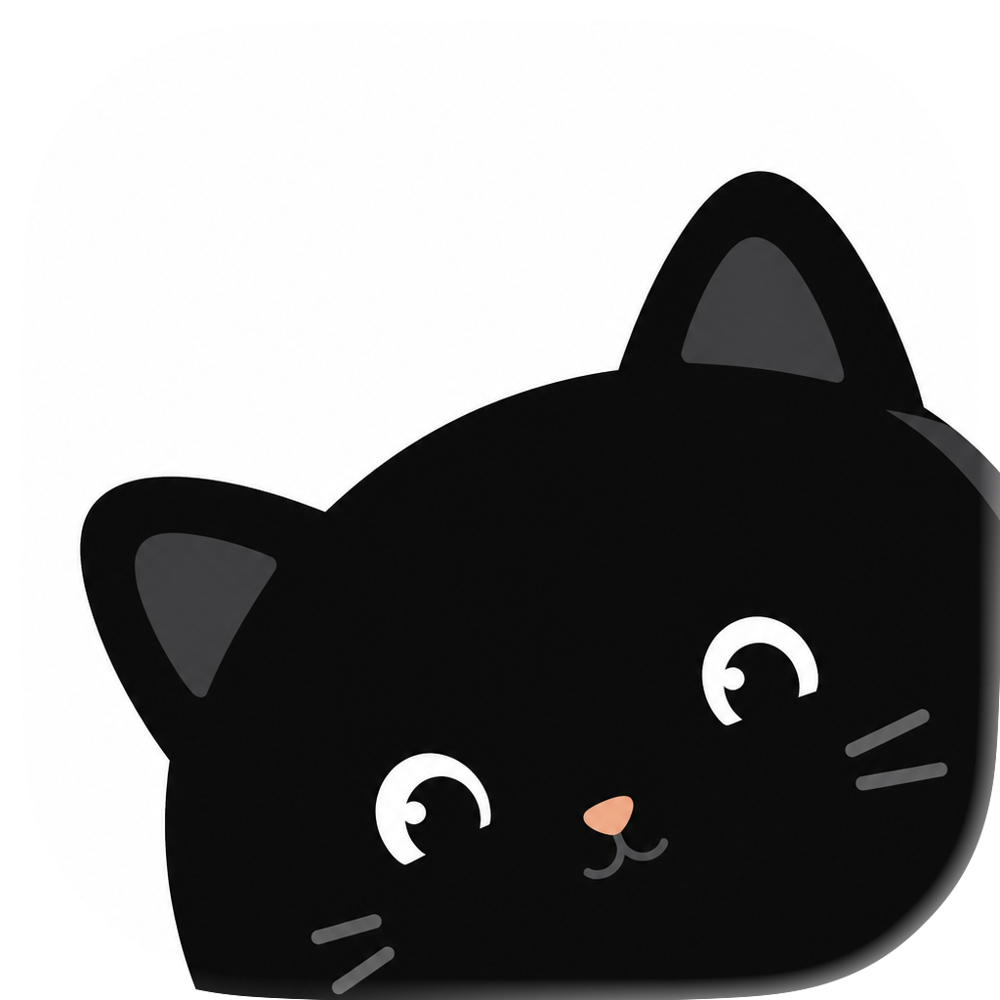

<p align="center">
  
</p>

<h1 align="center">Ousia Desktop</h1>

<p align="center">
  A quiet desktop client for running Pi coding agent sessions across local projects.
</p>

<p align="center">
  <a href="https://github.com/s1dashu/ousia-desktop/releases/download/v0.1.6/Ousia-0.1.6-arm64.dmg"><strong>Download macOS DMG v0.1.6</strong></a>
  ·
  <a href="#getting-started">Run from source</a>
  ·
  <a href="#development">Development</a>
</p>

## Download

Download the newest macOS build from
[GitHub Releases](https://github.com/s1dashu/ousia-desktop/releases/tag/v0.1.6)
or install it directly from
[Ousia-0.1.6-arm64.dmg](https://github.com/s1dashu/ousia-desktop/releases/download/v0.1.6/Ousia-0.1.6-arm64.dmg).

The release artifact is a `.dmg` installer. Open it, drag **Ousia** into
**Applications**, then launch the app from Applications.

> Ousia Desktop is still pre-release software. Expect fast iteration and
> occasional rough edges.

## What It Is

Ousia Desktop is a simplified Electron client for working with the Pi coding
agent. It keeps the product surface intentionally direct: pick a project, open a
chat session, choose a model provider, and let the agent work in that project's
directory.

## Highlights

- **Project-aware agent sessions**: each chat request includes a project path
  and session id, so Pi tool execution runs in the selected project directory.
- **Persistent sidebar workflow**: projects, sessions, expanded sections,
  sidebar layout, and window state are restored between launches.
- **Streaming chat UI**: assistant Markdown is rendered with Streamdown,
  including code blocks, tables, tool-call output, and compact status messages.
- **Attachments in composer**: add files and images directly to a message when
  the selected model supports them.
- **Model/provider settings**: configure provider API keys locally, choose the
  active model, and tune thinking level from the composer.
- **Appearance controls**: choose theme, color scale, app/chat fonts, and chat
  width from Settings.
- **Local runtime logs**: Electron main, renderer, and chat failures are written
  to `~/.ousia/logs/ousia-desktop.log`.

## Getting Started

### Requirements

- macOS for the primary desktop target.
- Node.js 24 or newer.
- npm 11 or newer.

Electron Forge maker configuration exists for other platforms, but release
packaging is currently validated for macOS first.

### Run From Source

```bash
npm install
npm run start
```

The app stores settings, sessions, and Pi agent data in Electron's app data
directory. Provider API keys entered in Settings are local app state, so treat
that machine state as sensitive.

## Development

Useful checks:

```bash
npm run typecheck
npm run lint
npm run check
```

Build a local production app bundle:

```bash
npm run package
```

Create a local macOS DMG:

```bash
npm run make
```

Signed and notarized release builds use Apple Developer credentials:

```bash
APPLE_SIGN_IDENTITY="Developer ID Application: Your Name (TEAMID)"
APPLE_ID="you@example.com"
APPLE_APP_SPECIFIC_PASSWORD="app-specific-password"
APPLE_TEAM_ID="TEAMID"
```

Then run:

```bash
npm run make:dmg:signed
npm run notarize:dmg
```

or:

```bash
npm run make:dmg:notarized
```

## Architecture

Ousia Desktop is an Electron + Vite + React app:

- `src/App.tsx` assembles the shell, sidebar/chat layout, settings state, and
  persistence.
- `src/features/chat/ChatArea.tsx` owns chat history, input, attachments, and
  composer controls.
- `src/features/settings/SettingsPage.tsx` renders app, appearance, model, and
  agent settings.
- `src/features/sidebar/Sidebar.tsx` handles project/session navigation.
- `src/electron/main.ts` registers IPC for app state, chat, models, logging, and
  window helpers.
- `src/electron/agent-conversations.ts` hosts Pi session creation, model
  selection, chat streaming, history, and interrupts.

The renderer talks to Electron main through the narrow `window.ousia` preload
API. Pi sessions are isolated by project/session and stored under Electron
`userData`.

## Project Docs

High-signal notes for future agents live in `AGENTS.md`. More detailed context:

- `docs/product-context.md`
- `docs/design-context.md`
- `docs/technical-architecture.md`
- `docs/development-state.md`
- `docs/streamdown.md`
- `docs/shadcn-reference.md`

## Third-Party Assets

Bundled CJK fonts are distributed under the SIL Open Font License 1.1. Their
license files live next to the font files under `src/assets/fonts/debug/`. See
`NOTICE` for details.

## Contributing

Contributions are welcome. Please read `CONTRIBUTING.md` before opening a pull
request, and run `npm run check` before submitting changes.

## License

Ousia Desktop is licensed under the MIT License. See `LICENSE`.
